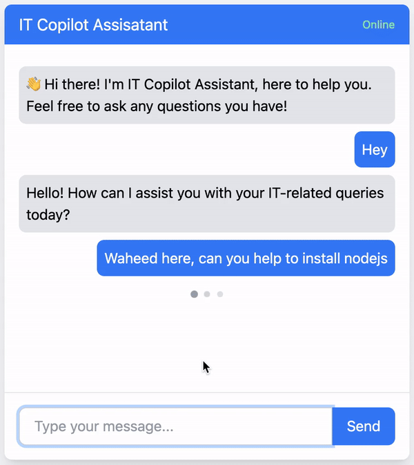

# IT Support Assistant

The IT Support Assistant chatbot is a powerful solution for providing automated IT support and assistance. Built with **Node.js** and **Express.js** on the backend and **React** with **Tailwind CSS** on the frontend, this assistant uses **OpenAI’s GPT API** to understand and respond to IT-related queries, trigger Slack automations, and assist with other IT-related tasks. It combines AI and real-time messaging capabilities to streamline support requests in organizations.

### Watch the Full Demo

Check out the [FULL DEMO HERE](https://drive.google.com/file/d/1EwHHppIyQGXiViCOCxRCsgqv-_isWabi/view?usp=sharing) to see the project in action!


## Key Features

- **Automated IT Support**: Uses OpenAI’s Assistant API to intelligently respond to common IT queries.
- **Slack Integration**: Triggers automated workflows and ticket creation in Slack for efficient task management.
- **Real-time Messaging**: Built with `socket.io` (optional), ensuring seamless real-time communication between users and the assistant.
- **Customizable**: Easily configure the assistant’s behavior and capabilities by adjusting parameters and environment variables.

## Technologies Used

- **Node.js and Express.js**: The backend server handles API requests, Slack automation, and interactions with the OpenAI API.
- **React and Tailwind CSS**: Provides a responsive, easy-to-navigate chat interface on the frontend.
- **OpenAI Assistant API**: Powering intelligent responses for IT support based on GPT-3.5, enabling real-time answers and seamless conversations.
- **Slack API**: Automates ticket generation and task assignments in Slack, streamlining communication between the assistant and the IT team.

## Project Structure

```plaintext
.
├── client/
│   ├── public/
│   │   ├── index.html
│   │   ├── manifest.json
│   │   └── robots.txt
│   ├── src/
│   │   ├── components/
│   │   │   └── ChatWindow.js
│   │   ├── App.js
│   │   ├── Axios.js
│   │   ├── index.css
│   │   ├── index.js
│   │   ├── reportWebVitals.js
│   │   └── setupTests.js
│   ├── .env
│   ├── .env.sample
│   ├── .gitignore
│   ├── package.json
│   ├── README.md
│   └── tailwind.config.js
├── routes/
│   ├── api.js
├── .env
├── .env.sample
├── .gitignore
├── package.json
├── server.js
└── README.md
```

## Prerequisites

- **Node.js** (v14 or higher)
- **npm** (v6 or higher)
- **OpenAI API Key**
- **Slack API Token**

## Getting Started

### Backend Setup

1. Clone the repository:

   ```sh
   git clone <repository-url>
   cd <repository-directory>
   ```

2. Install backend dependencies:

   ```sh
   npm install
   ```

3. Create a `.env` file in the root directory with your environment variables:

   ```plaintext
   OPENAI_API_KEY=your_openai_api_key
   SLACK_TOKEN=your_slack_token
   ASSISTANT_ID=your_assistant_id
   PORT=5000
   ```

4. Start the backend server:

   ```sh
   npm run dev
   ```

   The backend server will run on [http://localhost:5000](http://localhost:5000).

### Frontend Setup

1. Navigate to the frontend directory:

   ```sh
   cd client
   ```

2. Install frontend dependencies:

   ```sh
   npm install
   ```

3. Create a `.env` file in the `client` directory with your environment variables:

   ```plaintext
   REACT_APP_API_URL=http://localhost:5000/api
   ```

4. Start the frontend development server:

   ```sh
   npm start
   ```

   The frontend server will run on [http://localhost:3000](http://localhost:3000).

## Available Scripts

### Backend

- **`npm start`**: Starts the backend server.
- **`npm run dev`**: Starts the backend server with nodemon for development.

### Frontend

- **`npm start`**: Starts the frontend development server.
- **`npm run build`**: Builds the frontend for production.
- **`npm test`**: Launches the test runner in interactive watch mode.
- **`npm run eject`**: Ejects the Create React App configuration.

## API Endpoints

### Backend Endpoints

- **`POST /createAssistant`**: Creates a new IT Support Assistant.
- **`POST /updateAssistant`**: Updates the IT Support Assistant.
- **`GET /api/chat/create`**: Creates a new chat thread.
- **`POST /api/chat`**: Sends a message to the chat thread.

## License

This project is licensed under the MIT License.
